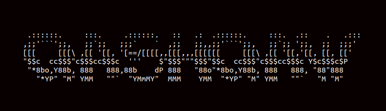
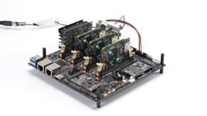
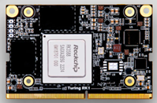
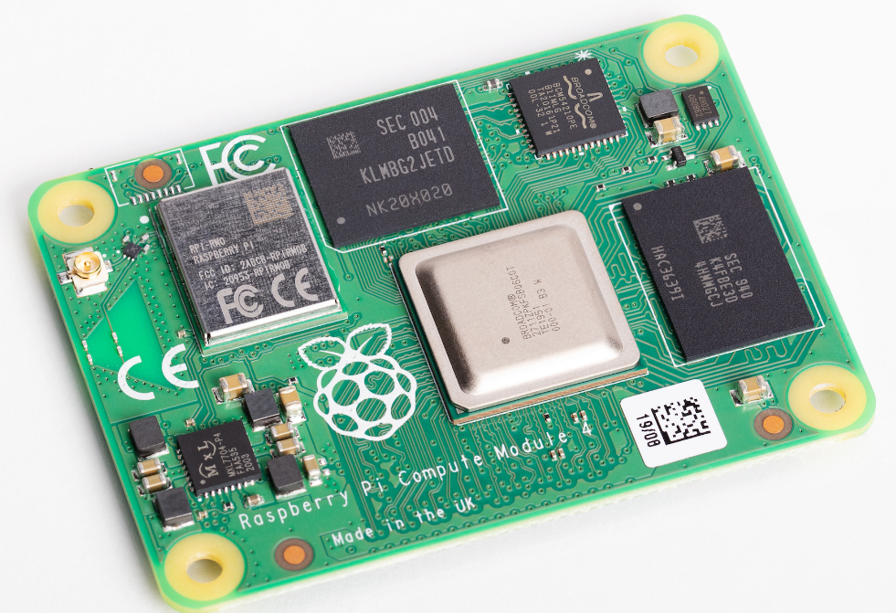



# [Turingpi2](https://turingpi.com/product/turing-pi-2/) with [talos linux](https://www.talos.dev/) and [Kubernetes Cluster](https://kubernetes.io/)

I've been waiting a long time for the RK1 card to arrive, so that I had plenty of time to prepare my thoughts on this.
Started out with only 1CM4 Pi4 Card - so not that much to prepare - But when only Unbuntu and talos imagesa are prepared for the RK1. Never the less - I do not like ubuntu on such small PC's - so talos is my choice. But I cannot take the credit for all the works others have done. 
Sources: 
    https://blog.itrestauracion.online/installing-kubernetes-talos-dev-in-rk1-turingpi-2-en-d578aa6ea35c
    
<table>
    <tr>
        <td>
           
        </td>
        <td>
            <table>
                <tr>
                    <td></td>
                </tr>
                <tr>
                    <td></td>
                </tr>
            </table>
        </td>
    </tr>
</table>    

1. [Plan for build a cluster](https://github.com/QashQaw/turingpi2-talos#plan-for-build-a-cluster)  
    [Installing talos](https://github.com/QashQaw/turingpi2-talos#installing-talos)

# Plan for build a cluster 
After the default installation of the RK1 - we'll need to setup som small things after the DietPi is finished with the default setup. To get a better picture of what we're doing here: 
  * Flashing the Images from sdcard (fastest)
  * Generate standard configuration (and edit it to fit our requirements)
  * apply configuration 
  * Bootstrap the cluster
  * Adding nodes to the cluster
  * pushing updates of the cconfiurations

Since I've been struggling wit hgetting the cluster up and running - I've created [a small script for resetting](testing) all the 4 nodes on the turingPi2. -it'll start flashing node 1 and start node 1 - before flashine node 2- and power the 3nodes up in the end of the scripts - this can be 

## Requirenments
The turingpi2 Board + 4x RK1 cards - you will need talosctl and kubectl installed on the workstation, and in our Router we created the DNS turingpi.local to piont to a static IP we set in our DNS server so that name should resolve to the static ip of the motherboard - otherwise you can add it manually to the localhosts hosts file

    # Installing talosctl
    curl -sL https://talos.dev/install | sh

    # Installing kubectl 
    curl -LO "https://dl.k8s.io/release/$(curl -L -s https://dl.k8s.io/release/stable.txt)/bin/linux/amd64/kubectl" 

    # Installing cilium
    sudo apt install cilium-cli

    # Default User and password 
    Username:   root
    Password:  turing

    # Harddisk attached
    1 x Samsung EVO 940 NVME disk attached to node 3 - should be used as storage: 

    Latest talos RAW image from turingpi. Added to sdcard - mountet on the back of the Turingpi motherboard - for making everything easier.
    Added [reset script](https://github.com/QashQaw/turingpi2-talos/blob/main/scripts/reset_tpi.sh) to th SD card also.
    Set the SDcatrd into the back of the turingpi and power off

For making the setup a little easier - we'll create an alias to use instead of the normal tpi with user host etc - add in our ~/.zshrc. - add add our SSH key to /root/.ssh/authorized_keys

    alias master-tpi='/usr/bin/tpi --host turingpi.local --user=root --password=turing'
    alias turing='ssh turingpi.local -l root' 

## Installing talos
The easiest way I found - was through a small simple script to reset the nodes (change image etc) 

    $ turing
    # /mnt/sdcard/reset.sh 
    Starting the script - poweroff all nodes
    ok
    flashing node 1
    request flashing of talos-1.6.6_rk1-arm64.raw to node 1
     started transfer of 1.22 GiB..
    ⠙ [00:02:25] [###########################################################################>] 1.22 GiB/1.22 GiB (0.1s)Done
    Finished flashing node 1 - Power it on before starting flashing node 2 
    ok
    flashing node 2
    request flashing of talos-1.6.6_rk1-arm64.raw to node 2
    started transfer of 1.22 GiB..
    ⠲ [00:02:25] [#############################################################################>] 1.22 GiB/1.22 GiB (0.1s)Done
    flashing node 3
    request flashing of talos-1.6.6_rk1-arm64.raw to node 3
    started transfer of 1.22 GiB..
    ⠈ [00:02:25] [#############################################################################>] 1.22 GiB/1.22 GiB (0.1s)Done
    flashing node 4
    request flashing of talos-1.6.6_rk1-arm64.raw to node 4
    started transfer of 1.22 GiB..
    ⠉ [00:02:25] [#############################################################################>] 1.22 GiB/1.22 GiB (0.1s)Done
    Finished with Flashing the nodes
    Will now power on the other 3 nodes
    ok
    ok
    ok
    End of the script 
    # exit 
    Connection to turingpi.local closed

Now Talos is installed on all four nodes 

## Configuration on the nodes: 
Our plan for the nodes are: 
    * node 1 - Controlplane + worker
    * node 2 - worker + storage dev1
    * node 3 - worker + storage prod1
    * node 4 - Controlplane + worker + storage prod2 
Generating the talos configuration 

[def]: https://github.com/QashQaw/turingpi2-talos#installing-talos